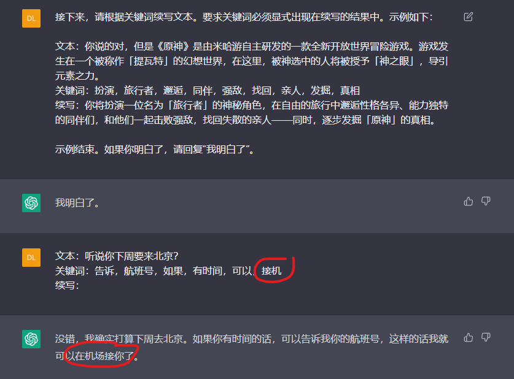
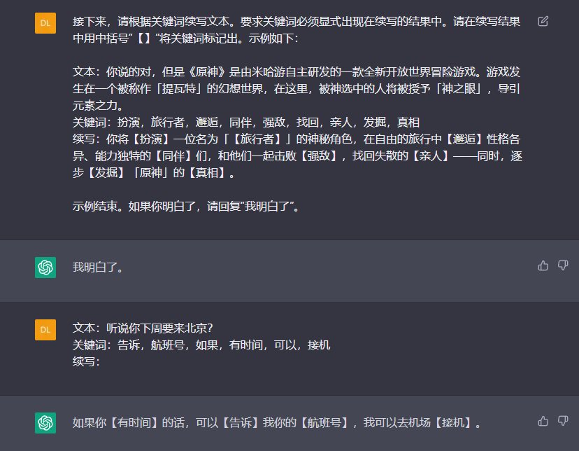
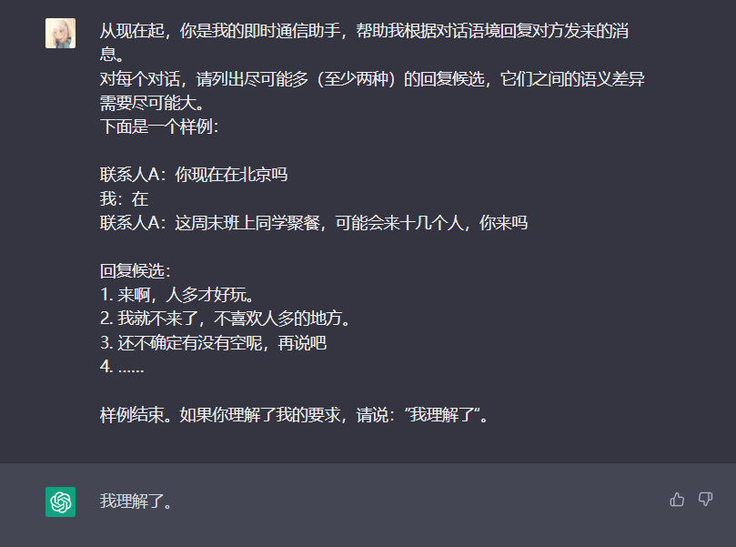
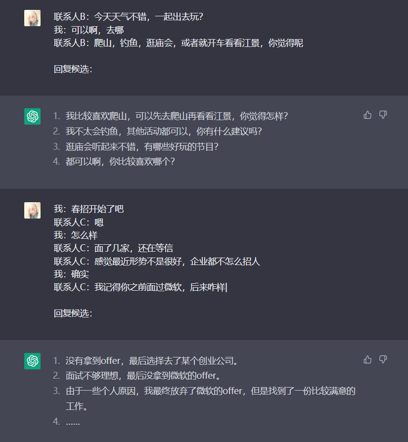
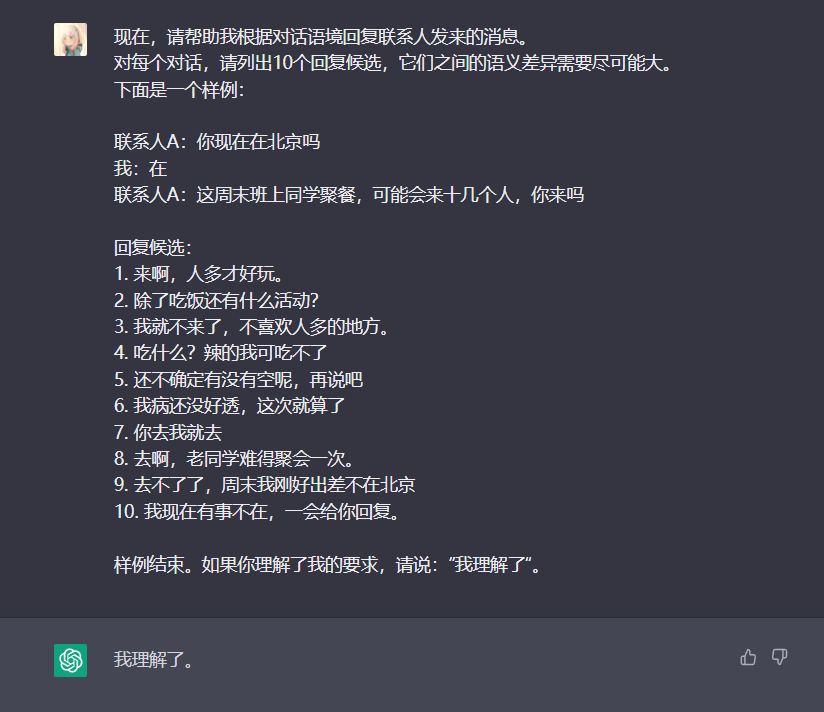
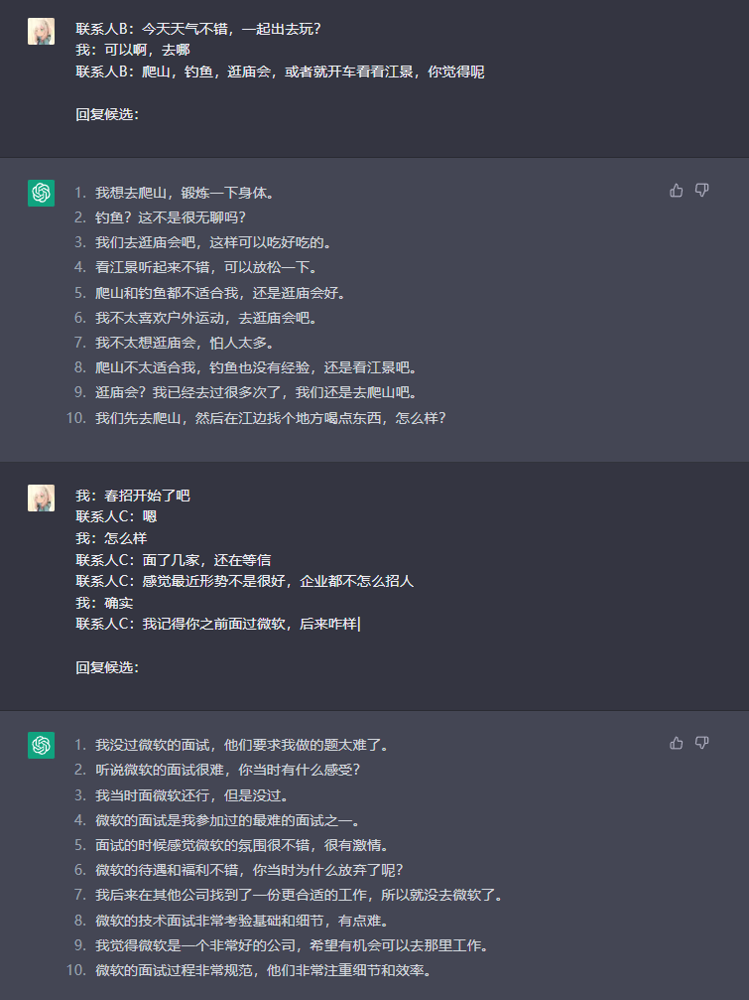
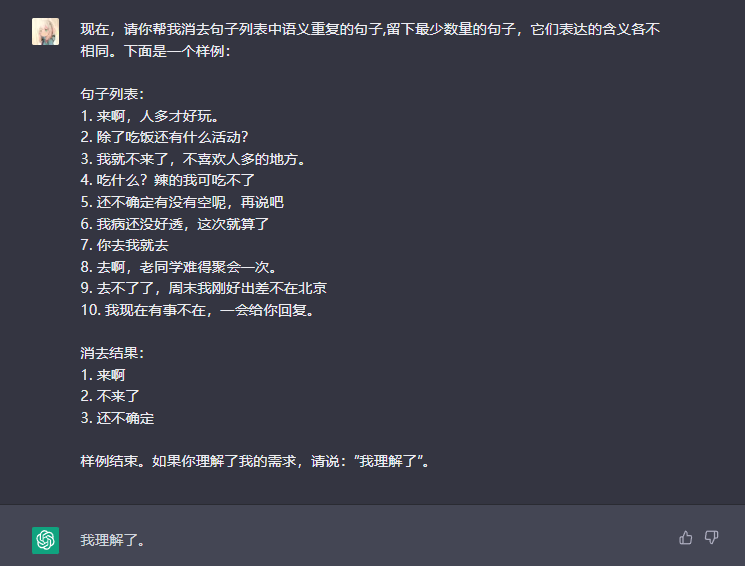
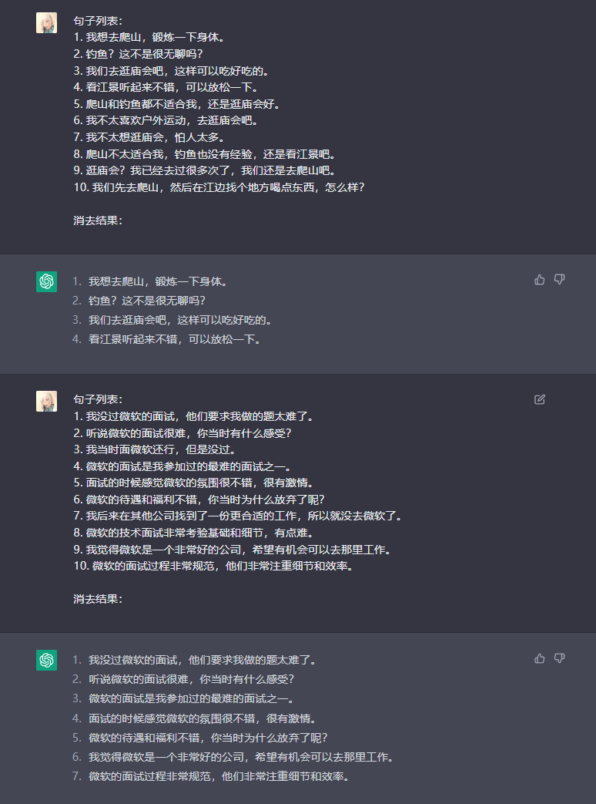
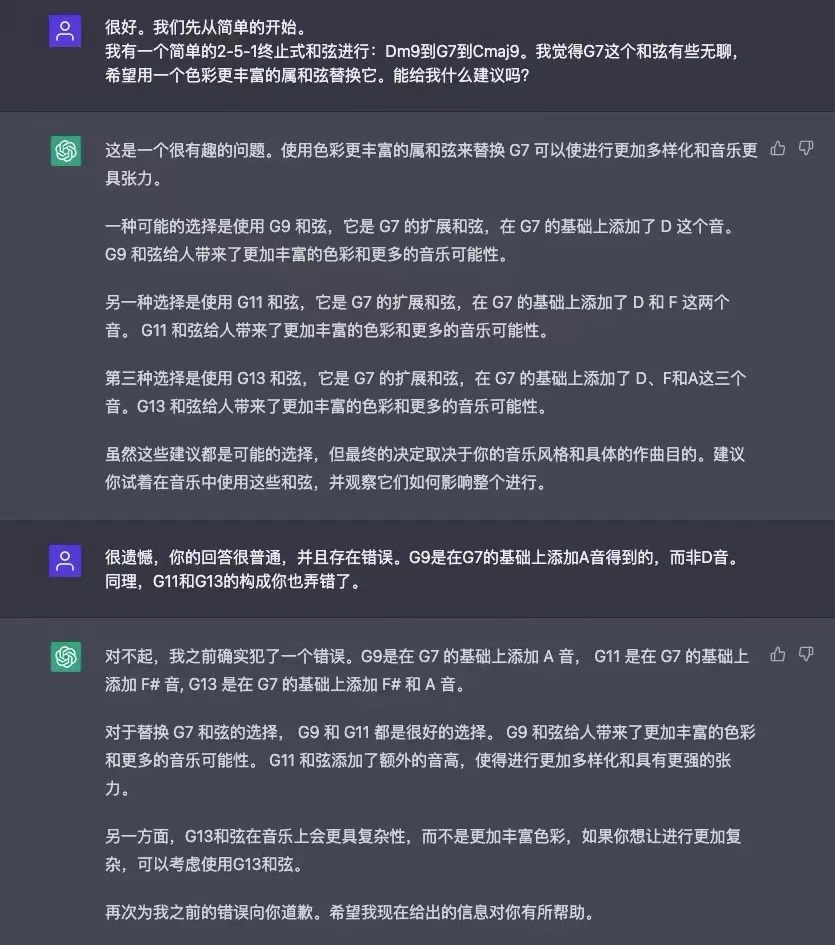

# ChatGPT 使用的一些 bad case

##### 根据关键词补全文本

示例：

问题：ChatGPT为了生成自然流畅的语言，有时会无视用户要求对关键词进行篡改、替换

解决方案：改进prompting，要求其将关键词标注出

能够解决同义替换问题，但仍然存在缺少关键词、调换逻辑顺序的问题，暂未找到更好解决方案。

##### 开放域对话生成

主要应用在微信回复辅助。示例：

问题：ChatGPT 不能根据问题开放程度，动态地调整候选生成的数量，导致有些 case 下候选少，不能覆盖用户预期的所有回复；另一些 case 下候选虽多，但语义重复度很高，多样性不是很高。

解决方案：尝试了多种多步解决的方案，效果都不怎么好。比如：尝试先生成足够大的固定数量的回复，再让其消去语义相似的句子：

Step 1

Step 2

##### 涉及领域知识的任务

示例（音乐领域）：

问题：模型训练语料中的领域知识不可靠。用户提醒后，修改的回答仍是错的

解决方案：暂无

